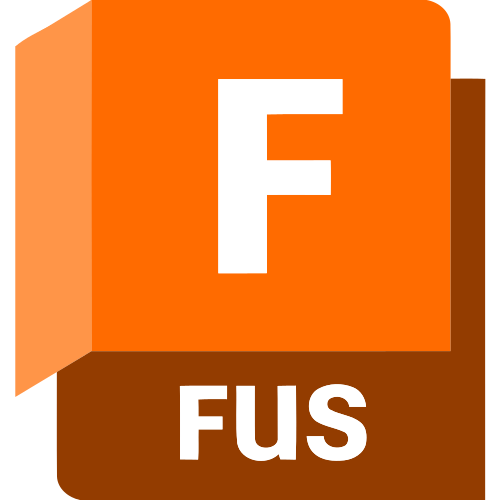

<!-- Dynamic Header Banner using Capsule Render -->

  <!-- Centered Subtitle Heading -->
  <b>Full-Stack & Embedded Systems | Computer Engineering Student</b>
    
  <!-- Centered Profile Views Counter Badge -->
  

---

## 💻 About Me

I am a Full-stack developer specializing in hardware integration, embedded systems, web ecosystems, and mobile application development. I focus on bridging the gap between robust physical hardware logic and modern, dynamic web architectures.

* 🛠️ **What I Do:** Actively building cross-platform mobile apps, automated IoT solutions, and local AI toolchains.
* 🎓 **Education:** Pursuing Computer Engineering to deeply understand network architectures and system design.

---

## 🔗 Connect With Me

  <!-- Gmail Badge (Forces a Web Browser Tab Draft) -->
  

> 📧 *If the Gmail button does not open your local mail app, you can reach me directly at:* **`scorch857@gmail.com`**

---

## 🛠️ Languages and Tools

### 🌐 Web & Mobile Development

  &nbsp;
  &nbsp;
  &nbsp;
  &nbsp;
  &nbsp;
  &nbsp;
  &nbsp;
  &nbsp;
  &nbsp;
  

### 🔌 Embedded Systems, Design & Architecture

  &nbsp;
  &nbsp;
  &nbsp;
  &nbsp;
  &nbsp;
  &nbsp;
  &nbsp;
  &nbsp;
  

---

## 📊 GitHub Analytics

  <!-- Core Stats Card -->
  
  <!-- Top Languages Card -->
  

---

## 📈 Activity Graph

  

  

